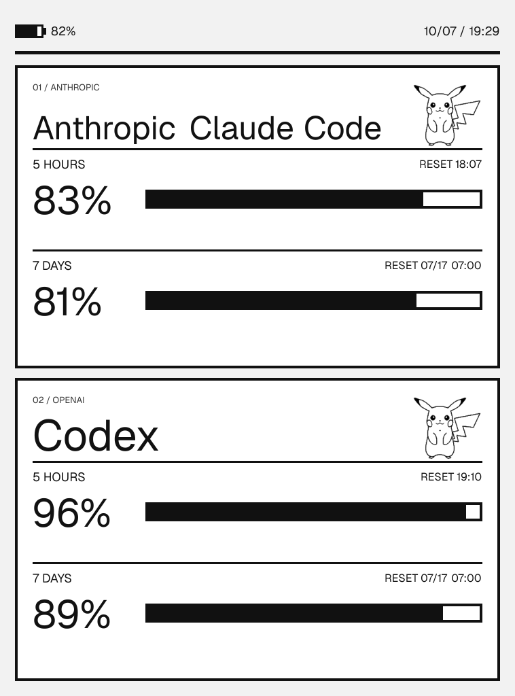

# Kindle LLM Token Dashboard

[](https://github.com/pcedison/kindle-LLM-token-display/actions/workflows/ci.yml)

A low-power, portrait e-ink dashboard for Claude Code and Codex subscription quota windows. Vercel renders an opaque grayscale PNG; a jailbroken Kindle downloads it and draws it with `eips`. Provider credentials remain inside the official local clients.



## Release Status

The renderer, signed ingest, shared collector, and reversible Windows and macOS installers are implemented and covered by automated tests. Production deployment and real-device acceptance are environment-specific final steps; do not call a fork production-ready until those checks pass.

## View Protection and Local Fixture

All Vercel environments require DASHBOARD_VIEW_TOKEN. Missing configuration returns 503; a missing or wrong request key returns 401. Public fixture rendering is local-only, explicit, unmanaged, and disconnected from Blob, managed configuration, device configuration, and live quota state.

For local artwork and layout checks, leave `DASHBOARD_VIEW_TOKEN` unset, set
`DASHBOARD_PUBLIC_FIXTURE=true`, and run `next dev`. This local-only unmanaged fixture
can render the manual display values from `.env.example`, but it cannot
use `managed=true`, Blob, live quota state, or `/api/device-config`. Combining
fixture mode with Vercel, production mode, or a configured view token is a
conflict and returns 503.

## Private Live Mode

Live mode reads the official local subscription quota surfaces:

- Claude Code status-line JSON: rolling 5-hour and 7-day windows.
- Codex app-server `account/rateLimits/read`: windows mapped by duration.

An Anthropic API key or OpenAI API key does not expose these subscription-plan quotas. The collector does not open provider credential files. Claude Code sends its status-line JSON to the configured child process, and the collector requests rate-limit JSON from the Codex app-server; both inputs are normalized in memory and all unapproved fields are discarded. Only percentages, reset timestamps, and collection timestamps are uploaded through the signed `/api/usage` endpoint.

Vercel stores the latest sanitized snapshot and keeps rendering it while every enrolled computer is asleep or off. This design does not require a computer, Windows PC, or Mac to remain on for the dashboard. Provider OAuth stays in the official local clients; Vercel never logs in to Claude or ChatGPT.

Cross-device usage is eventually consistent. Codex mobile or cloud usage is corrected by the next 12-minute desktop poll while an enrolled computer is awake. Claude mobile usage is corrected after the next Claude Code response on an enrolled desktop because that official response is what refreshes Claude's status-line limits.

Set up private Vercel Blob, `DASHBOARD_INGEST_TOKEN`, and required
`DASHBOARD_VIEW_TOKEN` by following [Vercel setup](docs/VERCEL-SETUP.md). The
data flow and schema are in [Architecture](docs/ARCHITECTURE.md), and the trust
boundaries are in [Security](docs/SECURITY.md).

## Windows Collector

Prerequisites:

- Node.js 20.9 or newer.
- Official Claude Code signed in with a Claude.ai subscription.
- Official Codex CLI signed in with ChatGPT.

Install from PowerShell:

```powershell
.\collector\install-windows.ps1 -IngestUrl '<DEPLOYMENT_ORIGIN>/api/usage'
```

Use the deployment origin reported by `vercel inspect`; do not save an
owner-specific deployment host in tracked files.

The installer prompts for the ingest token as a SecureString, stores runtime configuration under `%LOCALAPPDATA%\KindleLLMDashboard` with restricted ACLs, registers Claude's status line, and creates a per-user `Kindle LLM Quota Uploader-<GUID>` task. It runs at login and every 12 minutes while awake, catches up after resume, never wakes the computer, and rejects overlapping runs. The protected manifest retains that generated name across reinstalls. It refuses to replace a foreign Claude status line unless `-ReplaceExistingStatusLine` is supplied.

Diagnostics and removal:

```powershell
.\collector\diagnose-windows.ps1
.\collector\uninstall-windows.ps1
```

See [Windows collector](docs/WINDOWS-COLLECTOR.md) for installation, recovery, token rotation, and uninstall details.

## macOS Collector (Beta)

The macOS path remains Beta pending a complete real-Mac install, rollback,
LaunchAgent, and uninstall acceptance run.

Install from Terminal after signing in to the official clients:

```sh
./collector/install-macos.sh --ingest-url '<DEPLOYMENT_ORIGIN>/api/usage'
```

The ingest token is stored in the current user's Keychain. A per-user LaunchAgent runs at login and every 720 seconds while awake without keeping the Mac running. Diagnose or remove it with `./collector/diagnose-macos.sh` and `./collector/uninstall-macos.sh`. See [macOS collector](docs/MACOS-COLLECTOR.md) for ownership, recovery, and Keychain details.

## Kindle Setup

Supported profiles:

| Profile | PNG size | Device |
| --- | ---: | --- |
| `dp75sdi` | `758x1024` | Kindle Paperwhite 2 / DP75SDI |
| `kpw3` | `1072x1448` | Kindle Paperwhite 3 |
| `voyage` | `1080x1440` | Kindle Voyage |
| `basic` | `600x800` | Kindle Basic |

Copy `kindle-extension` to `<KINDLE_DRIVE>:\extensions\kindle-dash`, then edit
`local/env.sh` and replace `<DEPLOYMENT_ORIGIN>` with the origin reported by
`vercel inspect`. Keep the 12-minute local fallback:

```sh
export DASHBOARD_URL="<DEPLOYMENT_ORIGIN>/api/dashboard?profile=dp75sdi&managed=true"
export REMOTE_CONFIG_URL="<DEPLOYMENT_ORIGIN>/api/device-config?profile=dp75sdi"
export REFRESH_INTERVAL_SECS=720
```

Both URLs use the same view token. On Vercel, append it as the required `key`
query parameter to `DASHBOARD_URL` and `REMOTE_CONFIG_URL`. Never commit that
edited device file.

Safely eject the Kindle and use KUAL in this order:

1. `Display Test Frame`
2. `Display Cached Dashboard`
3. `Start LLM Token Dashboard`

The proven DP75SDI path keeps the Kindle framework running and does not clear the panel before `eips`. Leave `DASHBOARD_USE_RTC=false` until `Low Power Test (60 sec)` records `WAKE_SUCCESS` in `logs/low-power-test.log`.

`Start LLM Token Dashboard` hides Pillow and pauses the `awesome` window manager after KUAL closes so the native Wi-Fi, battery, and clock bar cannot redraw over the PNG. Press the physical power button once to exit dashboard mode; if the native sleep screen appears, press it again to return to Kindle. `Stop Dashboard / Restore Kindle`, normal daemon exit, and termination also restore system chrome without stopping the Kindle framework.

## Remote Dashboard Settings

Open the deployment root, choose a Kindle profile, and unlock the editor with
`DASHBOARD_ADMIN_TOKEN`. The root editor shell may load anonymously, but it
does not read or expose private configuration, artwork, Blob state, quota data,
or tokens until the admin-authorized configuration request succeeds. The editor
controls provider visibility, separate Claude Code and Codex artwork, and the
Kindle refresh interval. Source artwork may be PNG, JPEG, or WebP up to 5 MiB;
the browser places it on white and contain-fits it to an opaque `104 x 96` PNG
without cropping or stretching.

The refresh menu allows 10-50 seconds as explicit high-power test settings and
every whole minute from 1-15 minutes. Twelve minutes remains the recommended
continuous-display setting. Save creates a profile-scoped private configuration
and previews the authenticated managed PNG at the deployment origin. Obtain the
current origin with `vercel inspect`; tracked documentation does not embed a
deployment host.

Remote management needs a one-time USB migration of the Kindle extension and
its stable managed URLs. After that migration, changing artwork, providers, or
refresh cadence in the web editor needs no USB connection. The Kindle checks
`/api/device-config` before each PNG fetch and keeps its last valid interval and
cached PNG if the remote setting cannot be read.

For an existing installation, stop the dashboard, copy the updated extension
files over `extensions/kindle-dash` while preserving the private values in
`local/env.sh`, then replace only the two URLs with the managed forms above.
Safely eject and start the dashboard again. To roll back, restore the previous
query-driven `DASHBOARD_URL`, leave `REMOTE_CONFIG_URL` empty, and keep
`REFRESH_INTERVAL_SECS=720`; cached display and local cadence continue to work.

## Display Behavior

- Each provider shows independent 5-hour and 7-day remaining bars.
- Missing data displays `WAITING FOR LOCAL SYNC`.
- An unexpired value older than 30 minutes shows its last sync time.
- An elapsed reset without a newer observation displays `SYNC PENDING`, `--%`, and an empty bar instead of claiming a full reset.
- The Kindle supplies its own battery percentage on each request.
- PNG responses are fixed-size, opaque, 8-bit grayscale, non-interlaced, and not cached.

## Recovery

If the panel appears stuck in dashboard mode, press the physical power button once to restore native chrome; if the sleep screen appears, press it again to return to Kindle. When the stock UI is available, `Stop Dashboard / Restore Kindle` in KUAL is also safe. If needed, run `/mnt/us/extensions/kindle-dash/stop.sh` over SSH. A long power-button reboot remains the last resort when the watcher, KUAL, and SSH are unavailable.

For server or collector failures, use the runbooks in [Vercel setup](docs/VERCEL-SETUP.md), [Windows collector](docs/WINDOWS-COLLECTOR.md), and [macOS collector](docs/MACOS-COLLECTOR.md). Removing the private Blob deletes the latest sanitized snapshot; it does not affect provider accounts.

## Development

```powershell
npm.cmd install
npm.cmd test
npm.cmd run build
```

The project is licensed under the [MIT License](LICENSE).
